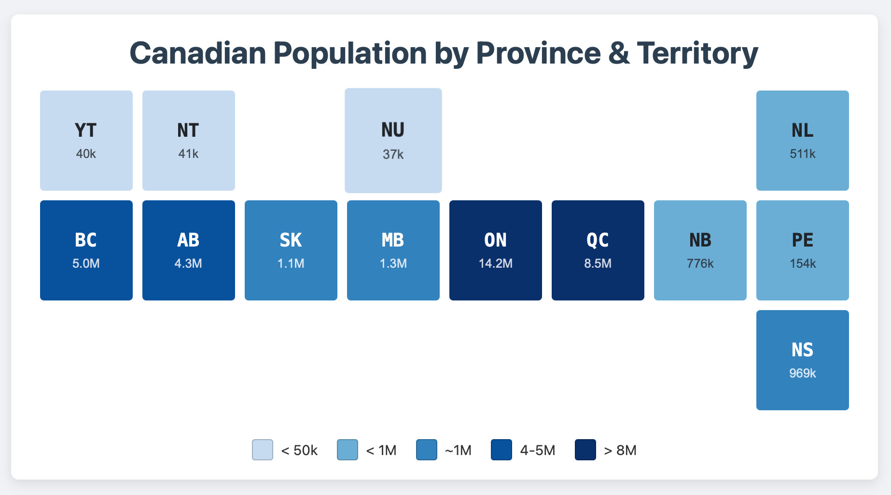

# canada-grid-tiles
The Canadian Cartogram: A Grid-Based View of Provincial Land Area

## Example

## Detailed Explanation of the Grid Representation

This visualization offers a unique way to understand the vast and varied land areas of Canada's provinces and territories. It intentionally trades geographic accuracy for data clarity, allowing for immediate and intuitive comparisons.
1. The Grid Layout: Abstracting Geography

Instead of using a traditional map where the complex shapes and massive size differences can be hard to compare (e.g., the tiny speck of Prince Edward Island next to the immensity of Quebec), this visualization uses a uniform grid.

    Structure: The layout is an 8-column grid, anchored by the contiguous line of provinces from British Columbia to Prince Edward Island in the second row. This establishes a logical, if not geographically precise, east-west flow.

    Relative Positioning: Other provinces and territories are placed in their approximate relative positions. The northern territories (YT, NT, NU) are on the top row, and the Atlantic provinces (NL, NS) occupy the easternmost columns. This maintains a general sense of the Canadian map.

    Purpose: By giving each province and territory an equally-sized cell, the grid removes geographic size as a visual factor. This forces the viewer to focus solely on the color to understand the underlying data, making comparisons more direct and effective.

2. The Data Representation: A Choropleth Approach

The grid uses a choropleth technique to visualize data. This is a method where geographic areas are shaded in proportion to a statistical variable.

    The Variable: The data being represented is land area in square kilometers (km²).

    The Color Scale: A sequential green color scale is used, where the intensity of the color directly corresponds to the size of the area:

        Lightest Green: Represents the smallest land areas (e.g., Prince Edward Island).

        Darkest Green: Represents the largest land areas (e.g., Nunavut, Quebec).

    The Legend: The legend at the bottom is crucial. It acts as the key, allowing a viewer to translate the different shades of green back into quantifiable area ranges (e.g., "> 1M km²").

3. Key Insights Revealed by the Grid

This visualization makes several key facts about Canada's geography immediately apparent:

    The Immensity of the North and Quebec: The darkest green cells for Nunavut, the Northwest Territories, and Quebec instantly draw the eye, highlighting that these three regions alone constitute a massive portion of Canada's landmass.

    The Scale of the "Big" Provinces: The consistent, dark-to-medium green of the provinces from BC to Ontario visually confirms that they are all exceptionally large, each comparable in size to many countries.

    The Compactness of the Maritimes: The most striking feature is the dramatic shift to lighter greens for the Atlantic provinces. It provides a stark visual contrast that emphasizes just how much smaller their land areas are compared to the rest of the country, with Prince Edward Island being an order of magnitude smaller than any other province.

    Simplified Comparison: It becomes easier to see that, for example, British Columbia and Ontario are in the same tier of size, a comparison that can be less obvious on a traditional map due to their different shapes.
